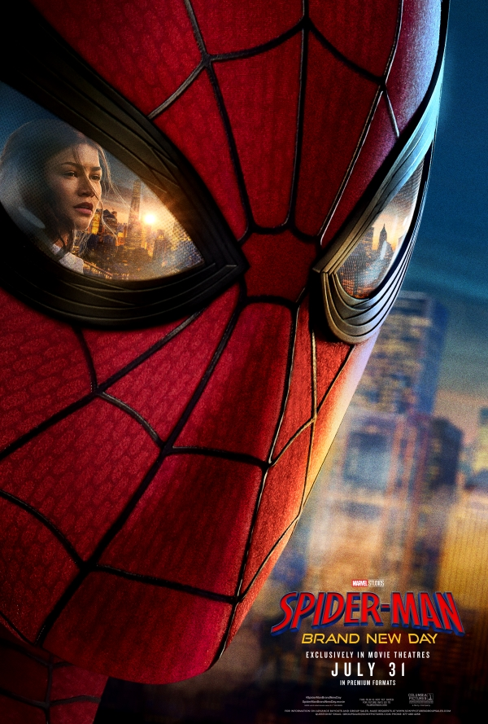

# SPIDER-MAN: BRAND NEW DAY - Sitio Web Oficial

[](https://github.com/tu-usuario/spiderman-brand-new-day)
[](LICENSE)

Sitio web inmersivo y cinematografico dedicado a la pelicula **Spider-Man: Brand New Day** de Marvel Studios. Construido con HTML5, CSS3 y JavaScript vanilla, optimizado para carga rapida y experiencia visual de nivel AAA.



## Caracteristicas

- **Diseño cinematografico** inspirado en la estetica de la pelicula
- **Animaciones fluidas** con CSS y JavaScript
- **Efectos visuales**: Anillos concetricos SVG, cursor personalizado, fondo de datos animado
- **Interacciones**: Hover effects en tarjetas de personajes con malla de telarana SVG
- **Minijuego interactivo** "Spider-Traverse" con Canvas 2D
- **Totalmente responsive** para desktop, tablet y movil
- **Optimizado para rendimiento** - carga rapida sin frameworks pesados
- **Accesible** - soporte para prefers-reduced-motion

## Tecnologias

- HTML5 semantico
- CSS3 (Grid, Flexbox, Animaciones, Variables)
- JavaScript (ES6+, Intersection Observer, Canvas API, SVG)
- Google Fonts (Kode Mono, Inter)

## Estructura del Proyecto

```
spiderman-brand-new-day/
|
|-- index.html          # Pagina principal
|-- styles.css          # Estilos y animaciones
|-- script.js           # Interactividad y juego
|-- README.md           # Este archivo
|
|-- images/
|   |-- hero-poster.png        # Poster principal
|   |-- peter-parker.jpg       # Peter Parker
|   |-- node-spiderman.png     # Spider-Man
|   |-- node-scorpion.jpg      # Scorpion
|   |-- node-tombstone.jpg     # Tombstone
|   |-- node-thehand.jpg       # The Hand
|   |-- cast-poster.jpg        # Poster del elenco
|   |-- gallery-1.jpg          # Galeria 1
|   |-- gallery-2.jpg          # Galeria 2
|   |-- gallery-3.jpg          # Galeria 3
|   |-- spidey-scorpion.jpg    # Spider-Man vs Scorpion
```

## Secciones

1. **Hero** - Anillos concetricos animados con logo de la pelicula
2. **Sinopsis** - Historia de la pelicula con panel HUD interactivo
3. **The Web (Villanos)** - Tarjetas interactivas de personajes con efecto telarana
4. **Spider-Traverse** - Minijuego interactivo de esquivar obstaculos
5. **Galeria** - Grid de imagenes de la pelicula
6. **Footer** - Datos de transmision con animacion de codigo

## Villanos Incluidos

| Personaje | Actor | Descripcion |
|-----------|-------|-------------|
| Spider-Man | Tom Holland | El heroe olvidado por el mundo |
| Scorpion | Michael Mando | Venenoso e implacable |
| Tombstone | Krondon | La mano fria del bajo mundo |
| Tarantula | ??? | Maestro de combate |
| The Hand | - | Sociedad ninja ancestral |

## Como usar

1. Clona el repositorio:
```bash
git clone https://github.com/tu-usuario/spiderman-brand-new-day.git
```

2. Abre `index.html` en tu navegador o usa un servidor local:
```bash
cd spiderman-brand-new-day
python3 -m http.server 8000
```

3. Visita `http://localhost:8000`

## Despliegue en GitHub Pages

1. Sube el repositorio a GitHub
2. Ve a **Settings > Pages**
3. Selecciona la rama principal como fuente
4. Tu sitio estara disponible en `https://tu-usuario.github.io/spiderman-brand-new-day/`

## Personalizacion

Los colores principales se definen en CSS custom properties al inicio de `styles.css`:

```css
:root {
    --void-black: #08090A;
    --bio-blue: #0A84FF;
    --spider-red: #FF453A;
    --concrete-grey: #8E8E93;
    --web-white: #F5F5F7;
}
```

## Optimizaciones de Rendimiento

- Imagenes con `loading="lazy"` para carga diferida
- Fuentes precargadas con `preconnect`
- Animaciones con `transform` y `opacity` (GPU-accelerated)
- Intersection Observer para animaciones de scroll
- Sin dependencias externas (zero dependencies)

## Compatibilidad

- Chrome 80+
- Firefox 75+
- Safari 13+
- Edge 80+

## Creditos

- **Marvel Studios** - Por crear el universo Spider-Man
- **Sony Pictures** - Por la distribucion de la pelicula
- Imagenes oficiales de la pelicula Spider-Man: Brand New Day (2026)

## Licencia

Este proyecto es una obra de fan sin fines comerciales. Los derechos de Spider-Man pertenecen a Marvel Comics y Disney.

---

**Spider-Man: Brand New Day - En cines 31 de julio de 2026**
